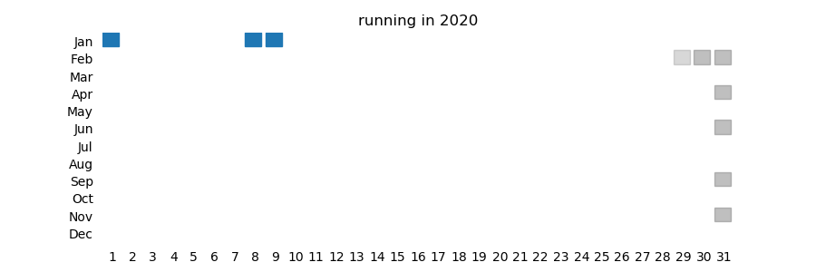

# bullet-journal-cli

This is a simple python script to log and track habits over a year

## How to use

To log a habit for a given day, run `python3 log.py -w HABIT`

To generate a graph, run `python3 driver.py -g HABIT`

## Example

A sample example would be tracking the habit "running". By running the command `python3 log.py -w running`, the file `./logs/2020-running.csv` would be generated. To graph, use the command `python3 driver.py -g running` and the file `./graphs/2020-running.png` would be generated.



## File structure
```
├── README.md
├── calendar_grapher.py ------------> holds utility function to generate the matplotlib graph
├── driver.py ----------------------> reads the csv and saves the generated graph in ./graphs
├── graphs -------------------------> stores generated graphs
│   └── 2020-running.png
├── io_generator.py ----------------> holds utility functions to write/read csv and graph files
├── log.py -------------------------> adds line to log files
└── logs ---------------------------> stores logs
    └── 2020-running.csv
```

## Todo 
- [ ] Generate a calendar for each month 
- [ ] Pick color for the generated calendar
- [ ] Handle already written lines
